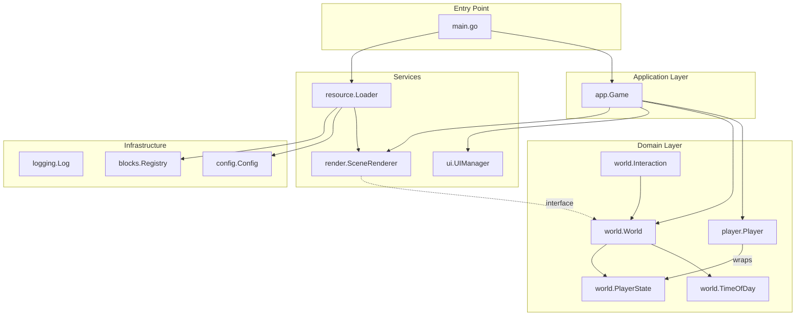
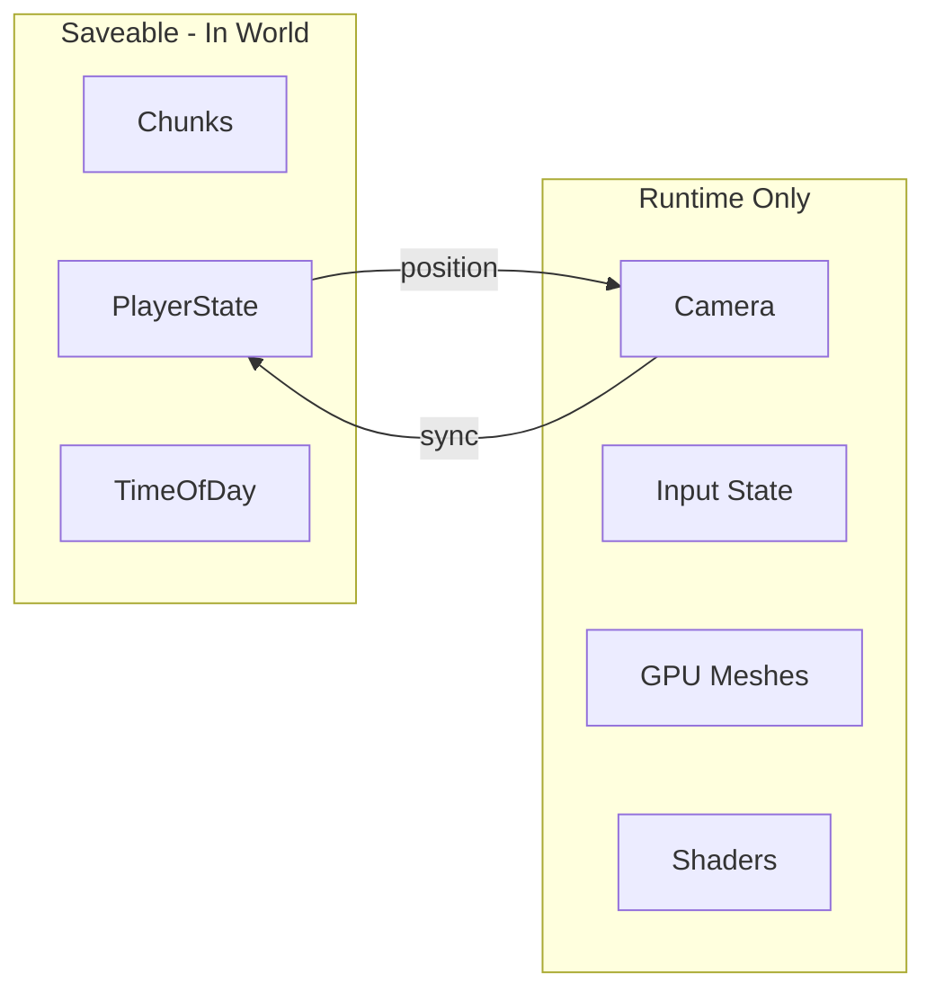

# Minae Architecture Refactoring Plan

## Current Problems

**1. `game.go` is a God Object (~300 lines)**

- Manages player, world, UI, lighting, shaders, materials, atlas, and meshes
- Handles resource loading, game loop, and rendering in one place
- Shader uniform management mixed with game logic

**2. World/Render coupling**

- `world/mesh.go` generates Raylib meshes but lives in `world` package
- `world.World` referenced directly by rendering code

**3. Scattered Resource Loading**

- Block loading in `main.go`, atlas in `game.go`, shaders embedded in `lighting`
- No clear initialization phases

**4. Missing Logging Infrastructure**

- Uses `log.Printf` with no levels
- Hard to debug specific subsystems

---

## Proposed Package Structure

```javascript
pkg/
├── app/                      # Application coordination (slim)
│   ├── app.go               # Game struct - thin coordinator
│   └── state.go             # Game state machine (Playing, Paused)
├── blocks/                   # Block definitions (minimal changes)
├── config/                   # Configuration (unchanged)
├── logging/                  # Structured logging setup
│   └── logging.go           # Logrus configuration
├── player/                   # Runtime player (wraps world state)
│   └── player.go            # Camera, input - wraps world.PlayerState
├── render/                   # All GPU/rendering concerns
│   ├── atlas/               # Texture atlas (existing)
│   ├── material/
│   │   └── material.go      # Shader + material management
│   ├── mesh/
│   │   ├── builder.go       # Reusable mesh builder (from world/mesh.go)
│   │   └── chunk.go         # ChunkMeshData generation
│   └── scene.go             # Scene renderer (draw calls, uniforms)
├── resource/                 # Centralized resource loading
│   └── loader.go            # Orchestrates all resource loading
├── ui/                       # UI (mostly unchanged)
└── world/                    # All saveable game state
    ├── chunk.go             # Chunk data storage
    ├── generator.go         # Terrain generation (extracted)
    ├── interaction.go       # Block placement/breaking logic
    ├── player_state.go      # NEW: Saveable player data (position, inventory)
    ├── time.go              # NEW: TimeOfDay (saveable, moved from lighting)
    ├── world.go             # World container (chunks + player + time)
    └── lighting/
        └── propagation.go   # Chunk lighting calculation only
```


### Key Design Decision: World Contains Saveable State

The `World` struct now contains all data that would be saved/loaded together:

- Chunk terrain data
- Player state (position, inventory)
- Time of day

This prepares for future save/load functionality where loading a world restores the complete game state.---

## Key Architectural Changes

### 1. Extract `SceneRenderer` from `Game`

Move all rendering logic from [`pkg/game/game.go`](pkg/game/game.go) to a new `pkg/render/scene.go`:

`````go
// pkg/render/scene.go
type SceneRenderer struct {
    shader        rl.Shader
    material      rl.Material
    atlas         *atlas.Atlas
    chunkMeshes   map[world.ChunkCoord]*rl.Mesh
    
    // Shader uniform locations
    locLightDir   int32
    locLightColor int32
    locAmbient    int32
    locViewPos    int32
    
    // Reusable buffers (moved from Game)
    shaderLightDir   []float32
    shaderLightColor []float32
    shaderAmbient    []float32
    shaderViewPos    []float32
}

func (r *SceneRenderer) UpdateMesh(coord world.ChunkCoord, data *mesh.ChunkMeshData)
func (r *SceneRenderer) SetLighting(sky, light, ambient rl.Color, dir rl.Vector3)
func (r *SceneRenderer) Draw(camera rl.Camera3D)
func (r *SceneRenderer) Unload()
```

### 2. Move Mesh Generation to `pkg/render/mesh/`

Relocate [`pkg/world/mesh.go`](pkg/world/mesh.go) to `pkg/render/mesh/` with a clear interface:

```go
// pkg/render/mesh/chunk.go
type WorldReader interface {
    GetBlock(x, y, z int) *blocks.Block
    GetBlockState(x, y, z int) (*blocks.Block, uint8)
    GetLight(x, y, z int) uint8
}

type ChunkReader interface {
    GetBlock(x, y, z int) *blocks.Block
    GetBlockState(x, y, z int) (*blocks.Block, uint8)
    ChunkX() int
    ChunkZ() int
}

// GenerateChunkMeshData builds mesh data without GPU upload
func GenerateChunkMeshData(chunk ChunkReader, world WorldReader, uvLookup UVLookup) *ChunkMeshData
`````

This inverts the dependency: render depends on an interface, not concrete `world.World`.

### 3. Centralize Resource Loading

Create [`pkg/resource/loader.go`](pkg/resource/loader.go) to orchestrate initialization:

```go
// pkg/resource/loader.go
type Resources struct {
    Atlas    *atlas.Atlas
    Shader   rl.Shader
    Material rl.Material
}

type Loader struct {
    dataFolder string
    log        *logrus.Entry
}

func (l *Loader) LoadBlocks() error           // blocks.Load()
func (l *Loader) LoadConfig() error           // config.Load()
func (l *Loader) LoadRenderResources() (*Resources, error) // atlas, shader, material
func (l *Loader) Unload(res *Resources)
```


### 4. World as Container for Saveable State

Update [`pkg/world/world.go`](pkg/world/world.go) to contain all saveable game state:

```go
// pkg/world/world.go
type World struct {
    Chunks      map[ChunkCoord]*Chunk
    PlayerState *PlayerState  // NEW: saveable player data
    TimeOfDay   *TimeOfDay    // NEW: saveable time
}

func NewWorld() *World {
    return &World{
        Chunks:      make(map[ChunkCoord]*Chunk),
        PlayerState: NewPlayerState(),
        TimeOfDay:   NewTimeOfDay(),
    }
}
```

Create [`pkg/world/player_state.go`](pkg/world/player_state.go):

```go
// pkg/world/player_state.go
type PlayerState struct {
    Position  [3]float32
    Inventory []*blocks.Block
}

func NewPlayerState() *PlayerState {
    return &PlayerState{
        Position:  [3]float32{0, 40, 0},  // Default spawn
        Inventory: blocks.GetAll(),
    }
}
```

Create [`pkg/world/time.go`](pkg/world/time.go) (extracted from lighting.go):

```go
// pkg/world/time.go
type TimeOfDay struct {
    Time          float32
    CycleDuration float32
}

func NewTimeOfDay() *TimeOfDay
func (t *TimeOfDay) Update(dt float32)
func (t *TimeOfDay) GetLightingState() (sky, light, ambient rl.Color, dir rl.Vector3)
```


### 5. Runtime Player Wraps World State

Refactor [`pkg/player/player.go`](pkg/player/player.go) to wrap the saveable state:

```go
// pkg/player/player.go
type Player struct {
    State            *world.PlayerState  // Reference to world's saveable state
    Camera           rl.Camera3D         // Runtime only
    MouseSensitivity float32             // From config
    
    // Raycasting state (runtime only)
    HasTarget        bool
    TargetBlock      rl.Vector3
    SelectedBlockIdx int
}

func NewPlayer(state *world.PlayerState) *Player {
    p := &Player{
        State:            state,
        MouseSensitivity: config.Current.MouseSens,
    }
    p.SyncFromState()  // Initialize camera from state position
    return p
}

func (p *Player) SyncFromState() {
    // Set Camera.Position from State.Position (used on load)
}

func (p *Player) SyncToState() {
    // Update State.Position from Camera.Position (used before save)
}

func (p *Player) Update(dt float32) {
    // Handle camera movement, sync position back to state
}
```


### 6. Extract Block Interaction from Player

Move interaction logic to [`pkg/world/interaction.go`](pkg/world/interaction.go):

```go
// pkg/world/interaction.go
type InteractionAction int

const (
    ActionNone InteractionAction = iota
    ActionBreak
    ActionPlace
)

type InteractionResult struct {
    AffectedChunks []ChunkCoord
    TargetBlock    [3]int
    HasTarget      bool
}

func ProcessBlockInteraction(
    w *World,
    cameraPos, cameraDir rl.Vector3,
    action InteractionAction,
    blockToPlace *blocks.Block,
    placeMeta uint8,
) InteractionResult
```


### 7. Add Structured Logging with Logrus

Create [`pkg/logging/logging.go`](pkg/logging/logging.go):

```go
// pkg/logging/logging.go
package logging

import (
    "os"
    "github.com/sirupsen/logrus"
)

var Log *logrus.Logger

func Init(level logrus.Level) {
    Log = logrus.New()
    Log.SetOutput(os.Stdout)
    Log.SetLevel(level)
    Log.SetFormatter(&logrus.TextFormatter{
        FullTimestamp: true,
    })
}

// Package-specific loggers
func ForPackage(name string) *logrus.Entry {
    return Log.WithField("pkg", name)
}
```

Usage throughout codebase:

```go
// In pkg/render/scene.go
var log = logging.ForPackage("render")

func (r *SceneRenderer) UpdateMesh(coord world.ChunkCoord, data *mesh.ChunkMeshData) {
    log.WithFields(logrus.Fields{
        "chunk_x": coord.X,
        "chunk_z": coord.Z,
    }).Debug("Updating chunk mesh")
}
```


### 8. Simplify `Game` Struct

After extraction, [`pkg/app/app.go`](pkg/app/app.go) becomes a thin coordinator:

```go
// pkg/app/app.go
type Game struct {
    state    GameState
    running  bool
    
    world    *world.World           // Contains chunks, PlayerState, TimeOfDay
    player   *player.Player         // Runtime player wrapping world.PlayerState
    renderer *render.SceneRenderer
    ui       *ui.UIManager
    
    log      *logrus.Entry
}

func NewGame(res *resource.Resources, dataFolder string) *Game {
    w := world.NewWorld()           // Creates world with embedded PlayerState + TimeOfDay
    w.GenerateFixedGrid()           // Generate terrain
    
    p := player.NewPlayer(w.PlayerState)  // Wrap world's player state
    
    // ... renderer, UI setup
}

func (g *Game) Update(dt float32) {
    g.world.TimeOfDay.Update(dt)    // Time is part of world
    g.player.Update(dt)             // Player syncs position to world.PlayerState
    // ...
}
```

---

## Dependency Flow (SOLID Compliant)




### Saveable vs Runtime State



---

## Logging Strategy

| Package | Log Level | Example Messages |

|---------|-----------|------------------|

| `app` | Info | "Game initialized", "State changed to Paused" |

| `resource` | Info/Debug | "Loading blocks from ...", "Atlas built with N textures" |

| `render` | Debug | "Mesh updated for chunk (X,Z)", "Shader uniforms set" |

| `world` | Debug | "Block set at (X,Y,Z)", "Lighting recalculated for chunk" |

| `player` | Trace | "Camera rotated", "Position updated" |---

## Files to Create/Modify

| Action | File | Description |

|--------|------|-------------|

| Create | `pkg/logging/logging.go` | Logrus setup and package loggers |

| Create | `pkg/resource/loader.go` | Centralized resource loading |

| Create | `pkg/render/scene.go` | Scene rendering extracted from game |

| Create | `pkg/render/mesh/builder.go` | Mesh builder (from world/mesh.go) |

| Create | `pkg/render/mesh/chunk.go` | Chunk mesh generation with interfaces |

| Create | `pkg/world/generator.go` | Terrain generation (extract from world.go) |

| Create | `pkg/world/interaction.go` | Block interaction logic |

| Create | `pkg/world/player_state.go` | Saveable player data (position, inventory) |

| Create | `pkg/world/time.go` | TimeOfDay with day cycle logic |

| Create | `pkg/app/app.go` | Slim Game coordinator |

| Create | `pkg/app/state.go` | Game state enum and transitions |

| Modify | `main.go` | Use resource.Loader, simplified init |

| Modify | `pkg/player/player.go` | Wrap world.PlayerState, remove interaction |

| Modify | `pkg/world/world.go` | Add PlayerState + TimeOfDay, remove fillChunkDebug |

| Modify | `pkg/world/lighting/lighting.go` | Remove day cycle, keep propagation only |

| Delete | `pkg/game/game.go` | Replaced by pkg/app/ |

| Move | `pkg/world/mesh.go` | To pkg/render/mesh/ |---

## Migration Strategy

1. **Phase 1**: Add logging infrastructure without changing existing code
2. **Phase 2**: Create world state structures (PlayerState, TimeOfDay in world package)
3. **Phase 3**: Refactor Player to wrap world.PlayerState
4. **Phase 4**: Extract mesh generation to render package with interfaces
5. **Phase 5**: Create resource loader and centralize initialization
6. **Phase 6**: Extract SceneRenderer from Game